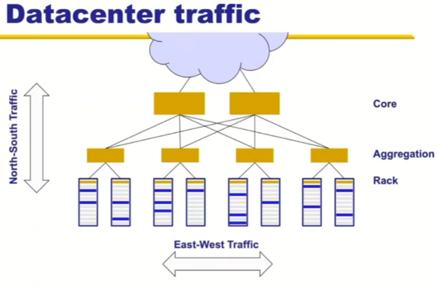
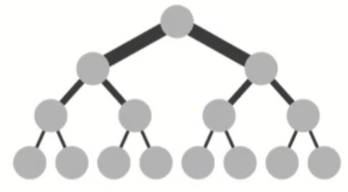

# Lecture 5: Video Streaming and Datacenter

## Video streaming

(stored) video is different than other resources

- video is too large for a single `GET` request
- user may skip forward, wasting resources
- user's connection may change, should switch to lower resolution

### Video file

- video is a sequence of frames displayed at a constant rate
  - doesn't need to arrive constantly
- a frame is an array of pixels, each pixel represented by bits
  - a frame of 1024x1024 pixels, 24bits/pixel -> 3 MB/frame
  - Movies: 24 frames/sec -> 72 MB/sec
  - TV: 30 frames/sec -> 90 MB/sec
- can save data using compression
- can pre-process to multiple resolutions

### HTTP streaming

- video is stored at a HTTP endpoint
- Client sends a `GET` request for the URL
- Server sends the video file as a _stream_
- client saves a buffer
  - to minimize interruptions later
- once the buffer is big enough, the client plays the video, while more buffer is being saved in the background
- Challenges
  - network delay variations
  - user interactions
    - jump, fast-forward, etc
  - packet loss, dupication, etc

### DASH: Dynamic Adaptive Streaming via HTTP

- Keep multiple resolutions of the same video
  - stored in a manifest file
- Client askes for the manefest file (to learn the resolutions availiable)
- Asks for chuncks at the time, measuring the bandwidth while doing so
  - low bandwidth -> switch to lower bitrate
  - high bandwidth -> switch to higher bitrate

## Cloud Systems

### Datacenters

- 1M servers/site [MS/Amazon/Google]
- $1B to build one [FB]
- $20M/month/site operational cost [MS]

### Implications

- Scale
  - need scalable design
  - low cost designs
  - high utilization: e.g.: >60% avg
    - contrast: avg utilization of internet is ~30%
  - tolerate frequent failure
    - large number of low cost hardware
  - automate
- Multi-tenancy (multiple customers) service model
  - performance guarantees
  - Isolation guarantees
    - virtual machines
  - Portability

### Applications

- Common theme: parallelism
  - application decomposed into tasks
  - run in parallel on different machines
  - Examples
    - Partition-Aggregate
    - Map-Reduce

### Map-Reduce

### DC networks

- ToR (top of rack) switch
  - easier to put switch at top for various reasons
- East-West traffic
  - traffic between server in the dc
- ideal: each server can talk to any other server at its full rate
  - need a DC with a giant switch
  - switch would be 10 Pbits/sec
    - 1M ports
    - 10 Gbps per port
- practical: use a network of switchs, each level having reasonable swtich
- Bisection bandwidth
  - partition network into two parts
  - min bandwidth between the partiions is the bisection bandwidth
  - Full bisection bandwidth: bisection bandwidth in a N node network is N/2 times the bandwidth of a single link
    - allows nodes at any two halves communicate at full speed
    - 
    - the switches at the top are often too expensive or unachivable
    - Oversubscription
      - not enough bandwidth at a high level switch
- Clos topology
  - acheieves full bisection bandwidth
  - k pods, each pods has two layers of k/2 switches
    - k/2 pods up, k/2 pods down
  - all links have same b/w
  - at most k^3/4 machines
- System must exploit the topology correctly
  - Routing must use all paths
  - Transport protocol must fill all pipes (fast)
