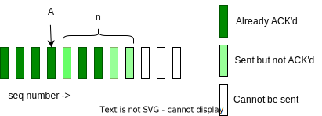

# Lecture 6: Transport Layer

## Transport Layer

### Motivation

Layer at end hosts, between the application and network layer

- IP addresses (network layer) capture hosts
- But end-to-end communication happens between applications
  - need a way to decide which packet go to which application (multiplexing/demultiplexing)
- IP (network layer) provides a weak service model (best-effort)
  - Packets can be corrupted, delayed, dropped, reordered, duplicated
  - No guidance on how much traffic to send and when

### Multiplexing and Demultipliexing

- Multiplexing (Mux)
  - Gather and combineing data chunks at the source from different applications and delivering to the network layer
- Demultiplexing (Demux)
  - Delivering correct data to corresponding sockets from a multiplexed stream

### Role of transport layer

- communication between _processes_ (as opposed to hosts)
- Provide common end-to-end services for app layer [optional]
  - reliable, in-order data
  - well-paced data delivery
    - too fast may overwhelm the networko
    - too slow is not efficient
- TCP and UDP are the common transport protocols
  - Also SCTP, MPTCP, SST, RDP, DCCP, ...

### TCP vs UDP

- UDP is a minimalist transport protocol
  - only provides ux/demux capabilities
- TCP offers a reliable, in-order, byte stream abstraction
  - With congestion control, but w/o performance guarantees (delay, b/w, etc.)

### QUIC transport protocol

- RFC 9000
- Built on top of UDP
- Packets are encrypted individually
- Faster connection setup by reusing the negotiated parameters from a previous connection
- Many other benefits: extensibilty, reduced sensitivity to packet loss, reduce HoL, etc

### Applications and sockets

- Socket: abstraction for app process to exchange network messages with the transport layer in the OS
- Ports: 16 bit number
  - OS stores mapping between sockets and ports
    - UDP: OS stores (local port, local IP address) <-> socket
    - TCP: OS stores (local port, local IP, remote port, remote IP) <-> socket

## UDP: User Datagram Protocol

### Format

- (source and destination) IP address and port, for mux and demux
  - source port is optional
- Checksum: optional error checking on packet
  - checksum = 0 means "don't verify checksum"

### Service model

- Best effort
- can be corrupted, delayed, dropped, reordered, duplicated
- no guidance on how much traffic to send and when

This is tedious for applications

## Reliable transport

### Stop and wait

- Sender
  - send packet i; reset timer; wait for ack
  - if (ACK)
    - i++; repeat
  - if (NACK or TIMEOUT)
    - repeat
- Receiver
  - Wait for packet
  - If packet is OK, send ACK
  - Else, send NACK
  - Repeat

This is correct, but very inefficient

### Sliding Window (also called "packets in flight")

- Window = set of adjacent seq numbers
- General idea: send up to n packets at a time
  - Sender can send packets in its window
  - Receiver can accept packets in its window
  - window of acceptable packets "slides on successful ACK
  - Window contains all packets that might still be in transit

- If window size is n, then throughput is roughly
  - MIN(n\*DATA/RTT, Link Bandwidth)
- Compare to Stop and Wait: Data/RTT

- Two options for ACK

  - Cumulative ACKs: ACK carries next in-order seq number the receiver expects
  - Selective ACKs: ACK individually acknowledges correctly received packets
    - Selective ACKs offer more precise info but require more complicated book-keeping

- GBN vs SR

### Summary: Components of reliable protocol

- Checksums (for err detection)
- Timers (for loss detection)
- Acknowledgments
  - Cumulative
  - Selective
- Sequence numbers (duplicates, windows)
- Sliding windows (for efficiency)
