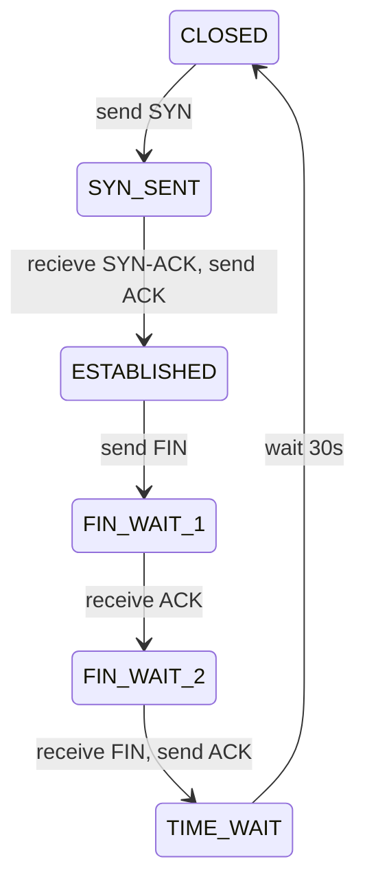
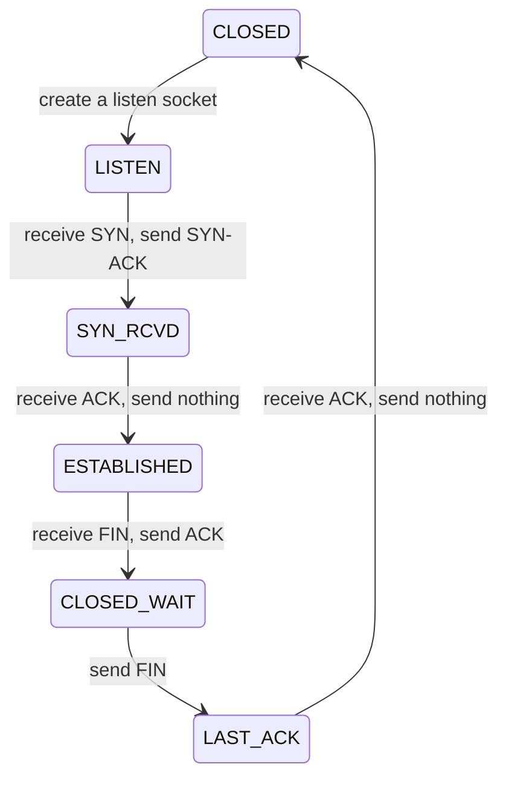

# Lecture 8: Flow and Congestion Control

Flow control: to make sure *client* is not overwhelmed

Congestion control: to make sure *server* is not overwhelmed

## TCP establishment
Client life cycle: 

Sever lifecyvle:

## Flow control
