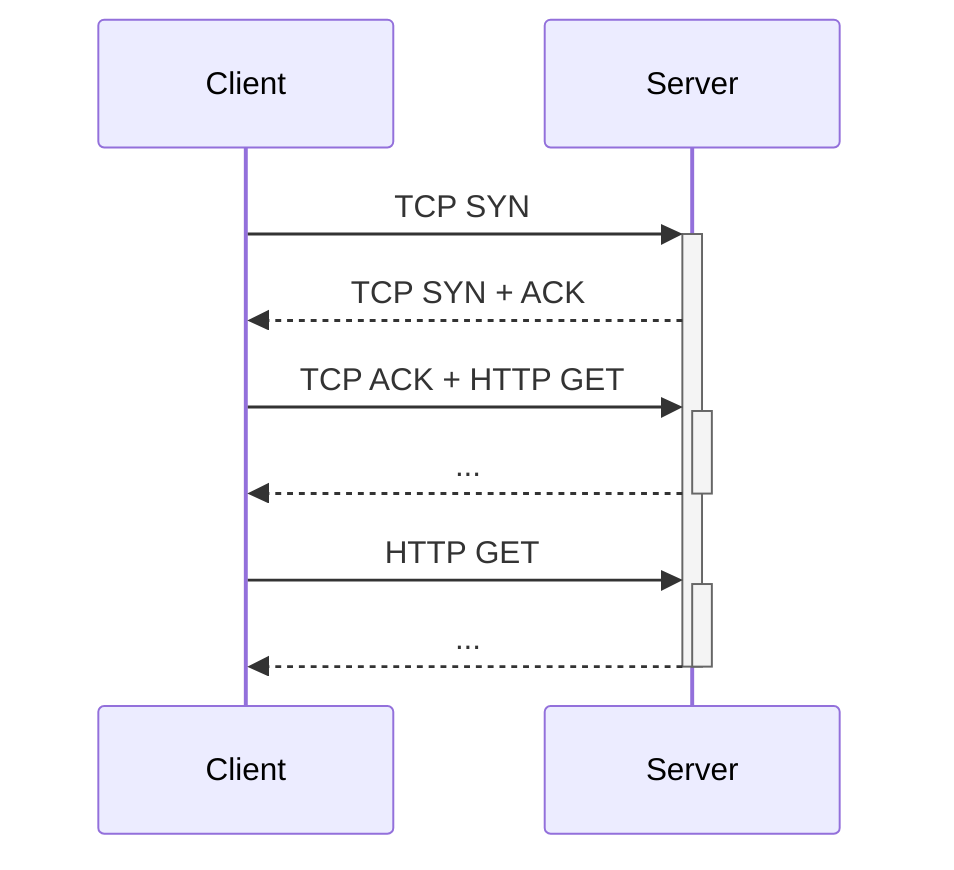
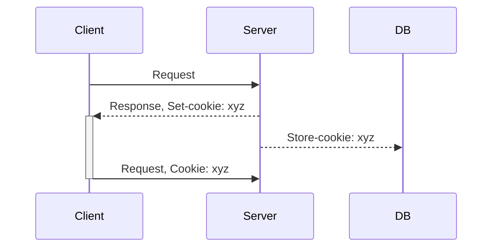
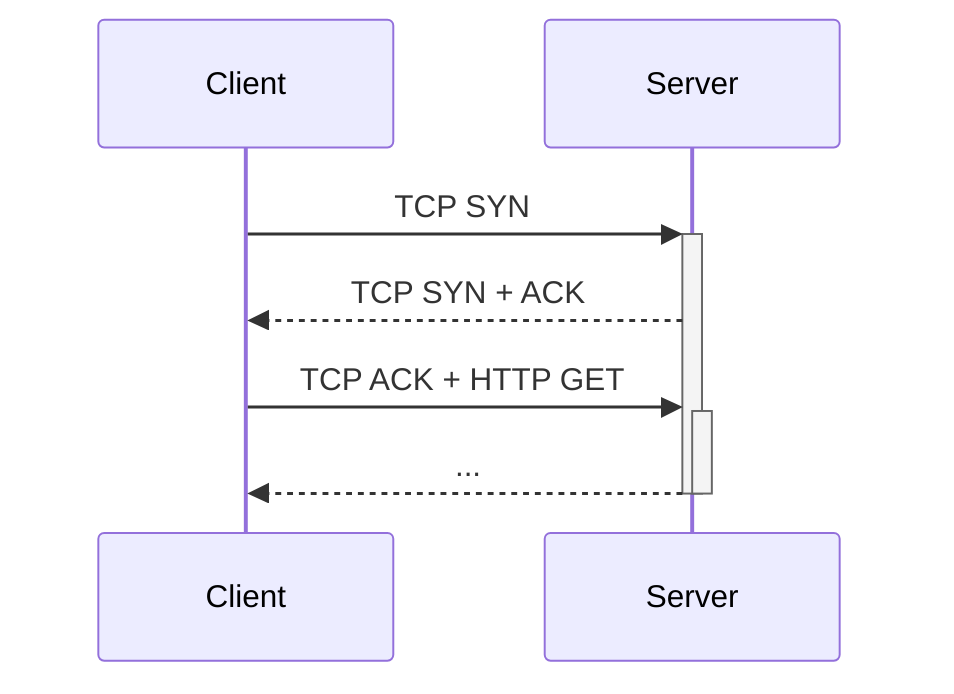
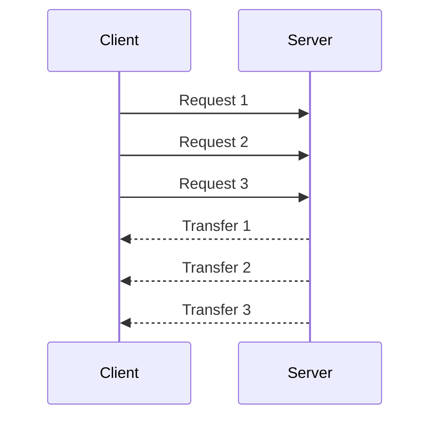

# Lecture 3

## HTTP History

- HTTP/1.1
  - Optimizations, security
- HTTP/2
  - Latency optimizations
  - Binary instead of text - faster
  - Server push
- HTTP/3 (June 2022)
  - Built on top of QUIC

## Web Components

- Infra
  - Clients
  - Server
    - DNS
    - CDN
    - Datacenters
- Content
  - URL: naming contents
  - HTML: formatting contents
- Protocol
  - HTTP

## URL

- `protocol://host-name[:port]/directory-path/resource`
  - Extend to server side program execution: `https://www.google.com/search?q=eecs489`

| Name             | Example                     |
| ---------------- | --------------------------- |
| `protocol`       | http, ftp, smtp, etc        |
| `host-name`      | DNS names, IP address       |
| `port`           | http:80, https:443          |
| `directory-path` | hierarchical, reflecting fs |
| `resource`       | ID the resource             |

## HTTP

- Client-Server architecture
- Runs over TCP (also QUIC in HTTP/3)
- Stateless - server have no state

- Methods
  - GET, HEAD - req info
  - POST - send info
  - PUT - upload file
  - DELETE - deletes file

## Cookies

- HTTP is stateless
  - improves server scalibility
- But some app need state
- Solution: put state on client side using cookies
  - client stores state (cookies)
  - client send state in future requests

- Cookie can be used to track people
- Solution: FLoC
  - Clusters people based on activity pattern, improves privacy

## Performance

### Goals

- User
  - Fast downloads (_not_ latency)
  - high availability
- Content providers
  - Cost effectiver
- Network
  - Avoid overload

### Solutions

- Improve networking protocols: HTTP, TCP, etc
- Cacheing % replication
- economies of scale
  - CDN, Datacenter, shared hosting, etc

### Object request

- RTT (round-trip time)
- Response time
  - 1 RTT for TCP setup
  - 1 RTT for TCP ack + HTTP request
  - Total: 2 RTT

### Concurrent requests

- Use multiple connections
- does not maintain order

### Persistant connections

- Maintain connections across multiple requests
  - Saves a round trip
  - allows underlying layers to learn about the bandwidth of the connection

### Pipelined requests & response

- FIFO order
  - can lead to head-of-line (HOL) blocking, if many small requests follow a large one
- Solution: priority and preemption
  - handled in HTTP/3 with QUIC

### Getting n small objects

- one at a time: 2n RTT
- m concurrent: 2[n/m] RTT
- persistant: (n+1) RTT
- pipelined: 2 RTT
- pipelined and persistant: 2 RTT first time; 1 RTT later from same connection
